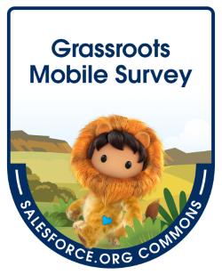

[Join the GRMS Trailblazer Community - Today!](https://trailhead.salesforce.com/trailblazer-community/groups/0F94S000000kI60SAE){: .btn .btn-pink }

<!--  -->

# Grassroots Mobile Survey App
Welcome to the Grassroots Mobile Survey App Documentation site, a resource for nonprofit organizations interested in using the app and people interested in contributing to the project.

## Brief History

After working with nonprofits in Nepal, India, Cambodia and Ethiopia, founder Trish Perkins recognized a need for mobile field surveys that sync with Salesforce. After perusing the market, she realized that none of the paid solutions were affordable for her clients. She set out to assemble a team of developers and others interested in making this service available not only to her clients, but to others in the nonprofit community. 

## Project Vision

The Grassroots Mobile Survey App team believes that mobile technology is critically important for meeting the missions of many nonprofits worldwide. These nonprofits must have staff in the field to bring their services to those in need who are unable to come to a central office. In the case of service-based organizations, the nonprofit's constituents are often better served in their home environments. In the case of emergencies and disasters, the constituents must be served in the field.

View the [Project Intro Video](https://drive.google.com/file/d/1KCUhyeCFtQvHle8lp9iGMNthKzeDXB5h/view?usp=drive_link) from our October 2021 Open Source Commons Sprint.
## Timeline

* 2015 - Pilot project for social service charity Hayden Hall was begun with health workers filling out paper forms and those forms being manually entered into Salesforce. This project was the inspiration for the Grassroots Mobile Survey app.
* 2017 - Salesforce developer Luis Campos-Guajardo created a proof of concept for the project.
* 2018 - MTX, a Salesforce consulting company in India, made the Hayden Hall project its Corporate Social Responsibility project for the year and developed the first prototype.
* 2019 - The first twelve mobile phones with the app installed were distributed to beta testers across the Himalayan region near Darjeeling
* 2020-2022 - The team began work on the next phase of the project with the goal of making it available across the nonprofit Salesforce sector.
* 2022 - App published after passing App Exchange security review.
* 2023-present - The team continues to refine the app and work on new features.

## Join Us

Join our group discussion in the [Trailblazer Community](https://trailhead.salesforce.com/trailblazer-community/groups/0F94S000000kI60SAE).

If you are a **nonprofit**: 
Your Salesforce Administrator just needs to do the [Getting Started](/getting-started/index) one-time setup before [Getting Your Field Workers Started](#getting-your-field-workers-started/index.md) with the mobile app. Then some [Further Customization](/further-customization/index.md) can make it more effective for you.

If you are an **aspiring contributor**: 
You can help us just by following the instructions in this wiki and giving us feedback about the process. Join our group discussion in the [Trailblazer Community group](https://trailhead.salesforce.com/ja/trailblazer-community/groups/0F94S000000kI60SAE). We also need [developers](docs/contribution/) and help with documentation, marketing, and support.

## Project Team

### Core Members:
* Trish Perkins (coordinator)
* Bhim Raj Manali (testing and declarative developer)
* Shun Kosaka (developer)
* Dar Veverka (project manager)
* Jung Mun (developer)
* Andy Engin Utkan (testing and declarative developer)

### Contributors:
* John Castelloe
* Rich Nevin
* Deanne Walters
* Casey Hart
* Karen Fitton
* Priya Rizal
* Michael Kolodner
* Richardson Handjaja
* Panupong Pichedwattana
* TJ Garza
* Jeremiah Olafisoye
* Badr Laabad
* TJ Warfield
* Melissa Hill Dees
* Hima Bindu Moka
* Lena Elsea
* Sena Günay
* Fesobi Saliu
* Lynda En
* Nicholas Rustigan
* James Daniel
* Gail McCall

### Esteemed Retired Members:
* Luis Campos-Guajardo
* Gaurav Kheterpal
* Umangshu Chouhan
* Anmol Mathur

_GRMS Field Team at Hayden Hall, Darjeeling, India_
